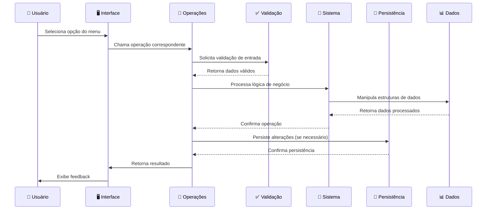
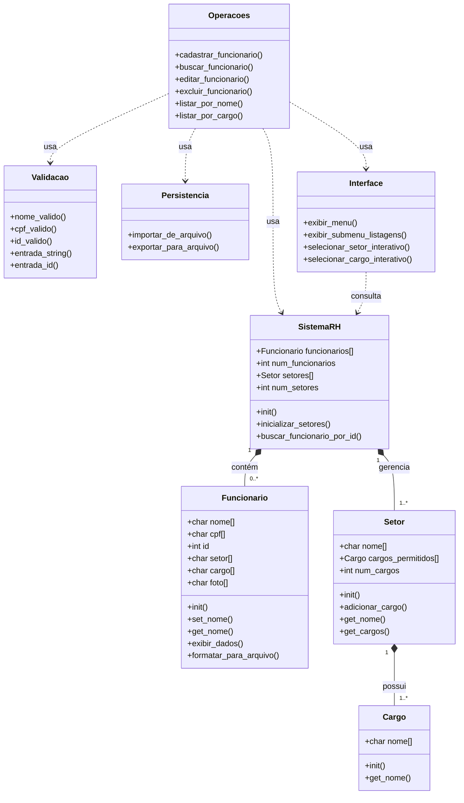
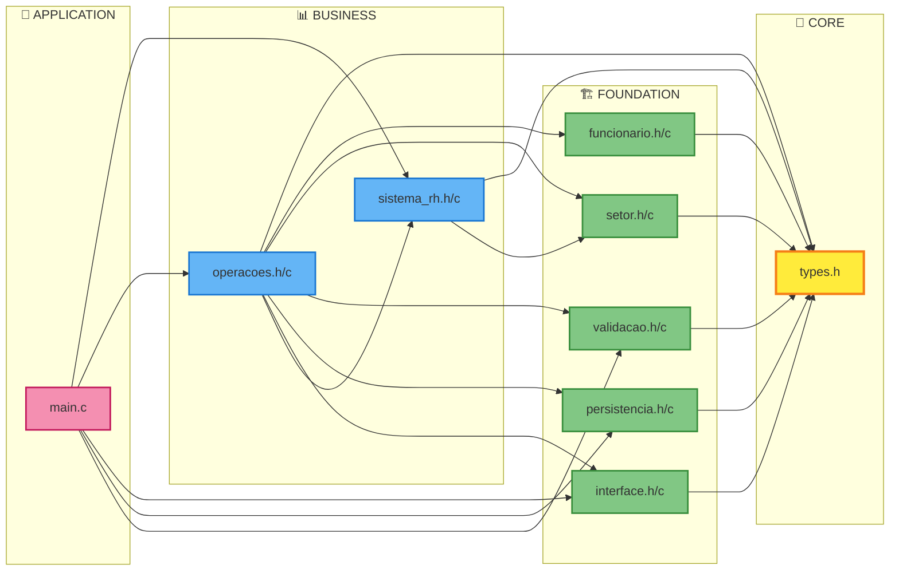
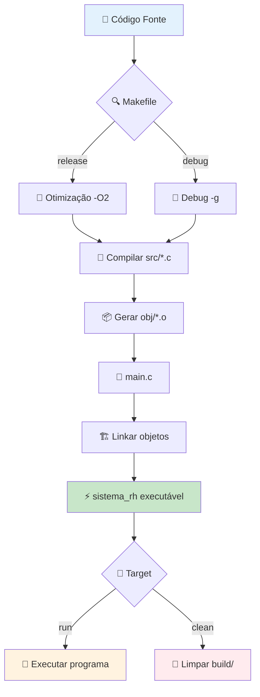

# 🏗️ Diagrama de Arquitetura - Sistema de RH

## 📋 Visão Geral da Arquitetura

```mermaid
graph TB
    subgraph "🖥️ INTERFACE DO USUÁRIO"
        A[main.c] --> B[interface.h/c]
        B --> C[Menu Principal]
        B --> D[Submenu Listagens]
        B --> E[Seleção Interativa]
    end

    subgraph "🔧 CAMADA DE OPERAÇÕES"
        F[operacoes.h/c] --> G[Cadastrar]
        F --> H[Buscar]
        F --> I[Editar]
        F --> J[Excluir]
        F --> K[Listar]
    end

    subgraph "🏢 CAMADA DE NEGÓCIO"
        L[sistema_rh.h/c] --> M[Gerenciar Sistema]
        L --> N[Inicializar Setores]
        L --> O[Buscar por ID]
        
        P[funcionario.h/c] --> Q[CRUD Funcionário]
        R[setor.h/c] --> S[Gestão Setores/Cargos]
    end

    subgraph "✅ CAMADA DE VALIDAÇÃO"
        T[validacao.h/c] --> U[Validar Nome]
        T --> V[Validar CPF]
        T --> W[Validar ID]
        T --> X[Entrada Segura]
    end

    subgraph "💾 CAMADA DE PERSISTÊNCIA"
        Y[persistencia.h/c] --> Z[Importar Arquivo]
        Y --> AA[Exportar Arquivo]
    end

    subgraph "📊 CAMADA DE DADOS"
        AB[types.h] --> AC[Estruturas]
        AC --> AD[Funcionario]
        AC --> AE[Setor]
        AC --> AF[Cargo]
        AC --> AG[SistemaRH]
    end

    %% Fluxo de dados
    A --> F
    F --> L
    F --> P
    F --> R
    F --> T
    F --> Y
    L --> AB
    P --> AB
    R --> AB
    T --> AB
    Y --> AB

    %% Estilos
    classDef interface fill:#e1f5fe,stroke:#01579b,stroke-width:2px
    classDef operations fill:#f3e5f5,stroke:#4a148c,stroke-width:2px
    classDef business fill:#e8f5e8,stroke:#1b5e20,stroke-width:2px
    classDef validation fill:#fff3e0,stroke:#e65100,stroke-width:2px
    classDef persistence fill:#fce4ec,stroke:#880e4f,stroke-width:2px
    classDef data fill:#f1f8e9,stroke:#33691e,stroke-width:2px

    class A,B,C,D,E interface
    class F,G,H,I,J,K operations
    class L,M,N,O,P,Q,R,S business
    class T,U,V,W,X validation
    class Y,Z,AA persistence
    class AB,AC,AD,AE,AF,AG data
```

## 🔄 Fluxo de Dados

## 🗂️ Estrutura de Módulos

## 📋 Dependências entre Módulos

## ⚡ Fluxo de Compilação

---

## 📝 Notas de Arquitetura

### 🎯 Princípios Aplicados

1. **Modularidade**: Cada módulo tem responsabilidade específica
2. **Baixo Acoplamento**: Módulos interagem através de interfaces bem definidas
3. **Alta Coesão**: Funcionalidades relacionadas agrupadas
4. **Reutilização**: Código compartilhado em módulos comuns
5. **Manutenibilidade**: Estrutura clara facilita modificações

### 🛡️ Camadas de Segurança

- **Validação de Entrada**: Todos os dados são validados
- **Proteção de Memória**: Uso seguro de strings e arrays
- **Verificação de Limites**: Prevenção de overflow
- **Confirmação de Ações**: Operações críticas requerem confirmação
