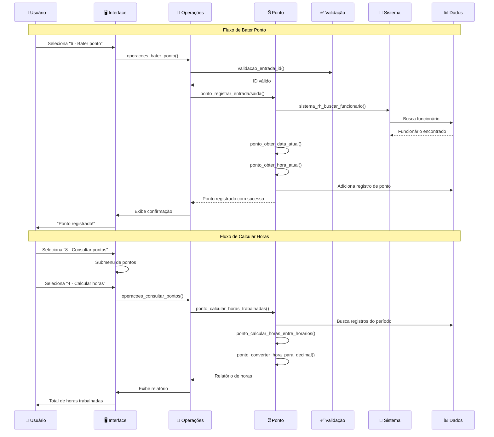
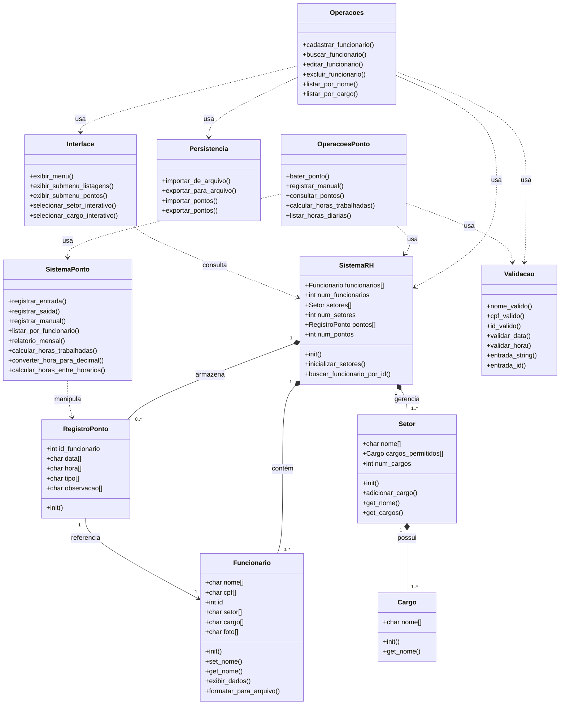
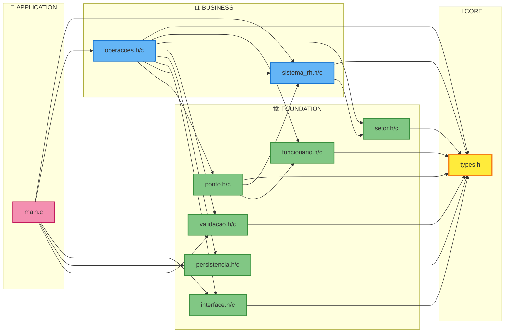
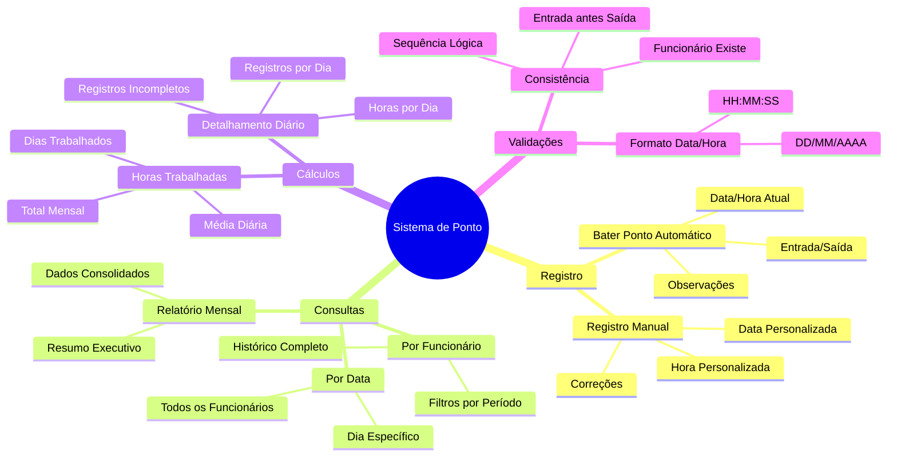

# 🏗️ Diagrama de Arquitetura - Sistema de RH

## 📋 Visão Geral da Arquitetura

```mermaid
graph TB
    subgraph "🖥️ INTERFACE DO USUÁRIO"
        A[main.c] --> B[interface.h/c]
        B --> C[Menu Principal]
        B --> D[Submenu Listagens]
        B --> E[Submenu Pontos]
        B --> F[Seleção Interativa]
    end

    subgraph "🔧 CAMADA DE OPERAÇÕES"
        G[operacoes.h/c] --> H[Cadastrar]
        G --> I[Buscar]
        G --> J[Editar]
        G --> K[Excluir]
        G --> L[Listar]
        G --> M[Bater Ponto]
        G --> N[Consultar Pontos]
    end

    subgraph "🏢 CAMADA DE NEGÓCIO"
        O[sistema_rh.h/c] --> P[Gerenciar Sistema]
        O --> Q[Inicializar Setores]
        O --> R[Buscar por ID]
        
        S[funcionario.h/c] --> T[CRUD Funcionário]
        U[setor.h/c] --> V[Gestão Setores/Cargos]
        W[ponto.h/c] --> X[Sistema de Ponto]
        W --> Y[Cálculo de Horas]
        W --> Z[Relatórios]
    end

    subgraph "✅ CAMADA DE VALIDAÇÃO"
        AA[validacao.h/c] --> BB[Validar Nome]
        AA --> CC[Validar CPF]
        AA --> DD[Validar ID]
        AA --> EE[Validar Data/Hora]
        AA --> FF[Entrada Segura]
    end

    subgraph "💾 CAMADA DE PERSISTÊNCIA"
        GG[persistencia.h/c] --> HH[Importar Funcionários]
        GG --> II[Exportar Funcionários]
        GG --> JJ[Importar Pontos]
        GG --> KK[Exportar Pontos]
    end

    subgraph "📊 CAMADA DE DADOS"
        LL[types.h] --> MM[Estruturas]
        MM --> NN[Funcionario]
        MM --> OO[Setor]
        MM --> PP[Cargo]
        MM --> QQ[RegistroPonto]
        MM --> RR[SistemaRH]
    end

    %% Fluxo de dados
    A --> G
    G --> O
    G --> S
    G --> U
    G --> W
    G --> AA
    G --> GG
    O --> LL
    S --> LL
    U --> LL
    W --> LL
    AA --> LL
    GG --> LL

    %% Estilos
    classDef interface fill:#e1f5fe,stroke:#01579b,stroke-width:2px
    classDef operations fill:#f3e5f5,stroke:#4a148c,stroke-width:2px
    classDef business fill:#e8f5e8,stroke:#1b5e20,stroke-width:2px
    classDef validation fill:#fff3e0,stroke:#e65100,stroke-width:2px
    classDef persistence fill:#fce4ec,stroke:#880e4f,stroke-width:2px
    classDef data fill:#f1f8e9,stroke:#33691e,stroke-width:2px

    class A,B,C,D,E,F interface
    class G,H,I,J,K,L,M,N operations
    class O,P,Q,R,S,T,U,V,W,X,Y,Z business
    class AA,BB,CC,DD,EE,FF validation
    class GG,HH,II,JJ,KK persistence
    class LL,MM,NN,OO,PP,QQ,RR data
```

## 🔄 Fluxo de Dados - Sistema de Ponto

## 🗂️ Estrutura de Módulos Atualizada

## 📋 Dependências entre Módulos Atualizada

## 🚀 Funcionalidades do Sistema de Ponto

## 📊 Métricas e Relatórios

### 🕒 Cálculo de Horas
- **Conversão**: HH:MM:SS → Decimal (8.75h)
- **Método**: Primeira entrada × última saída do dia
- **Validação**: Ignora registros inválidos
- **Precisão**: Até segundos

### 📈 Tipos de Relatório
1. **Horas Trabalhadas**: Total mensal com média
2. **Detalhamento Diário**: Todos os pontos do dia
3. **Registros Incompletos**: Identificação automática
4. **Histórico Completo**: Por funcionário/período

---

## 📝 Notas Arquiteturais

### 🎯 Novos Princípios Aplicados (Sistema de Ponto)

1. **Separação de Responsabilidades**: Módulo ponto.h/c independente
2. **Cálculos Centralizados**: Funções específicas para conversões
3. **Relatórios Flexíveis**: Múltiplas formas de visualização
4. **Validação Robusta**: Data/hora com formatos específicos
5. **Persistência Dupla**: Funcionários e pontos em arquivos separados

### 🛡️ Camadas de Validação (Ponto)

- **Formato**: Validação de data DD/MM/AAAA e hora HH:MM:SS
- **Lógica**: Saída não pode ser antes da entrada
- **Existência**: Funcionário deve existir no sistema
- **Consistência**: Avisos para sequências incomuns

### 🔄 Padrões de Design (Sistema de Ponto)

- **Calculator Pattern**: Funções específicas para cálculos
- **Report Builder**: Diferentes tipos de relatório
- **Validation Chain**: Múltiplas validações em sequência
- **Data Transformation**: Conversão de formatos de hora